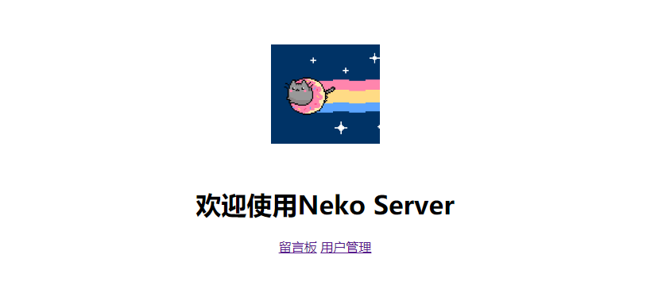
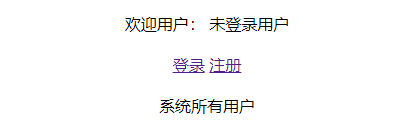
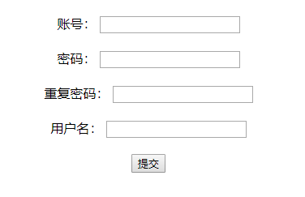
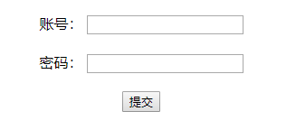
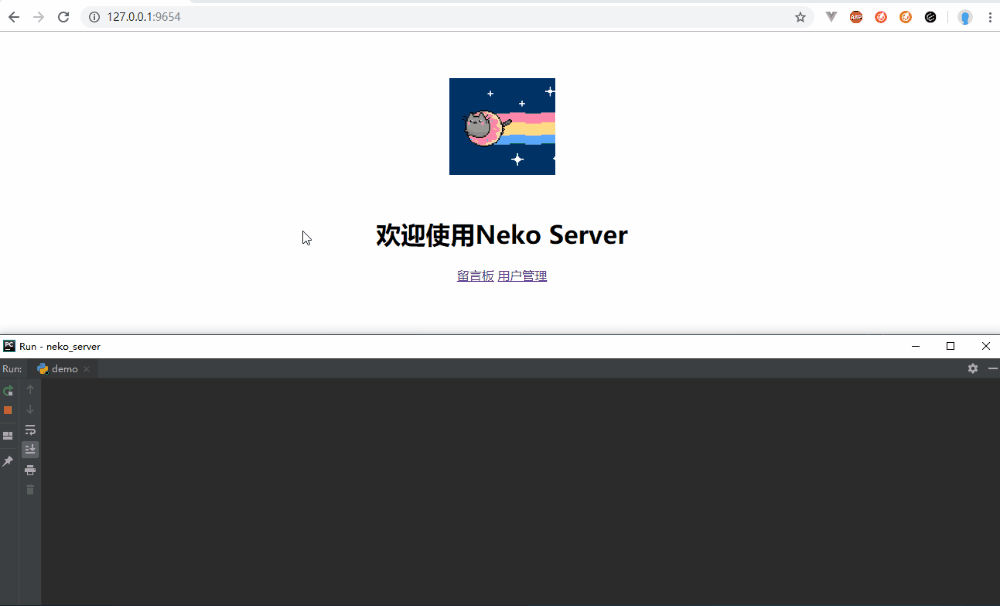
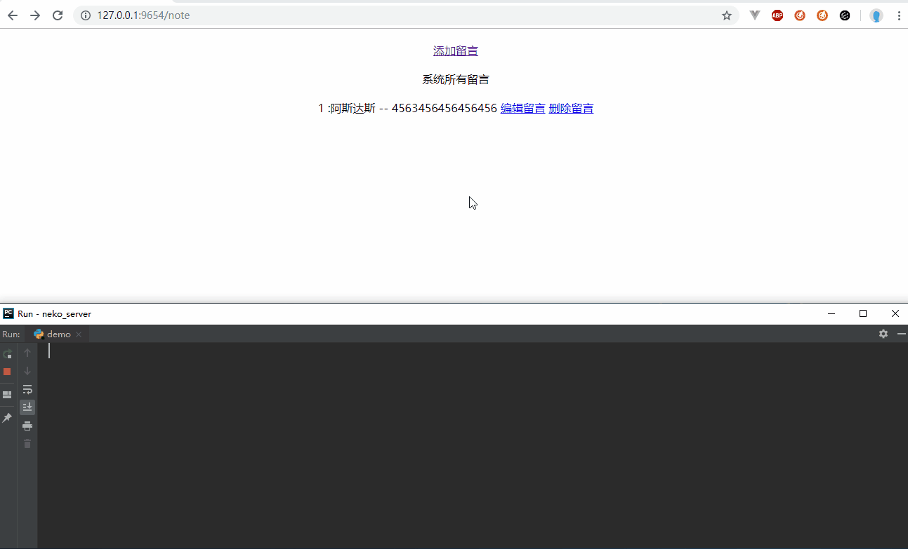

# 基于Python实现的MVC Web服务器：neko server

项目说明

1. neko server仅依赖PyMySQL对MySQL连接进行支持，实现了完整的MVC功能的web服务器
2. 浏览器请求通过TCP连接进来后会通过分析生成request类，使用对应的函数进行处理
3. Router会解析设置的路由规则和request path进行匹配，返回正确的处理函数，或返回404处理函数
4. 处理函数返回response类，可以设置响应的头部，可以返回文件。neko server会处理成正确的响应返回浏览器
5. 自带静态文件处理函数，设置静态文件目录后可以自动响应静态文件请求
6. 模板管理器：可以读取模板文件目录，并且处理对应的模板函数，生成正确的html文件。支持的模板语法有：1.赋值，2.判断if，3.循环for。并且可以嵌套使用，覆盖大部分使用场景
7. orm：使用对象封装数据库对象和相应操作，支持增删改查，并且可以更field类型对传入数据进行检测
8. 丰富的view支持：重定函数；模板渲染函数；错误处理函数
9. 自带一个demo项目，展示了neko server的使用

## 图片

1 demo主页

2. 用户管理

3. 用户注册

4. 用户登录

5. 权限功能演示

6. 留言功能演示

